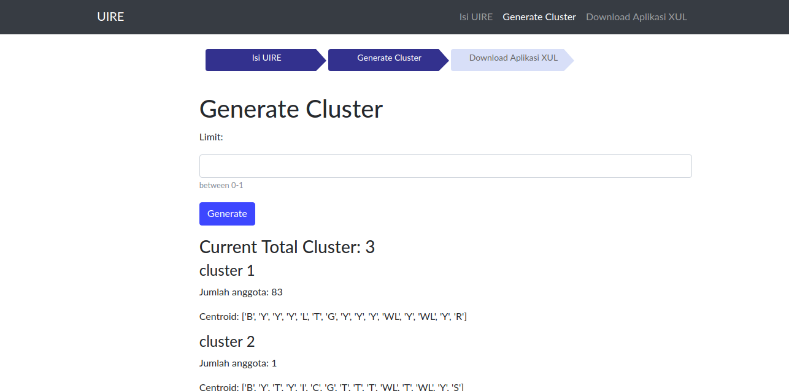

# Uire Application
> Clustering application of uire survey input with [art] algorithm

[art]: https://en.wikipedia.org/wiki/Algorithmic_art

## Installation
- clone this repo to your computer `git clone https://github.com/alviandk/uire.git`.
- go to the project directory and install the requirement `pip install -r requirements.txt`.
- run the server with the command `python manage.py runserver`
- open in browser http://localhost:8000/

## User Guide

There are 3 main features in this app:
- Submit Uire Survey
- Generate Cluster
- Download XUL Application

- Submit Uire Survey

This feature is to input the uire survey data by the user.
Users choose the answer option of each question, after 15 questions filled and then users submit it.
Survey filling can be done by many users.

- Generate Cluster

After the number of surveys has been enough, cluster generation can be done to find out how many categories of users based on the answers survey. Enter the value of tanimoto coefficient limit with a range of values between 0 and 1.
After that press the `Generate` button to generate the cluster.

- Download XUL Application

The cluster that has been generated can be downloaded in xul file and run with xulrunner to generate uire user interface in accordance with the cluster category.

